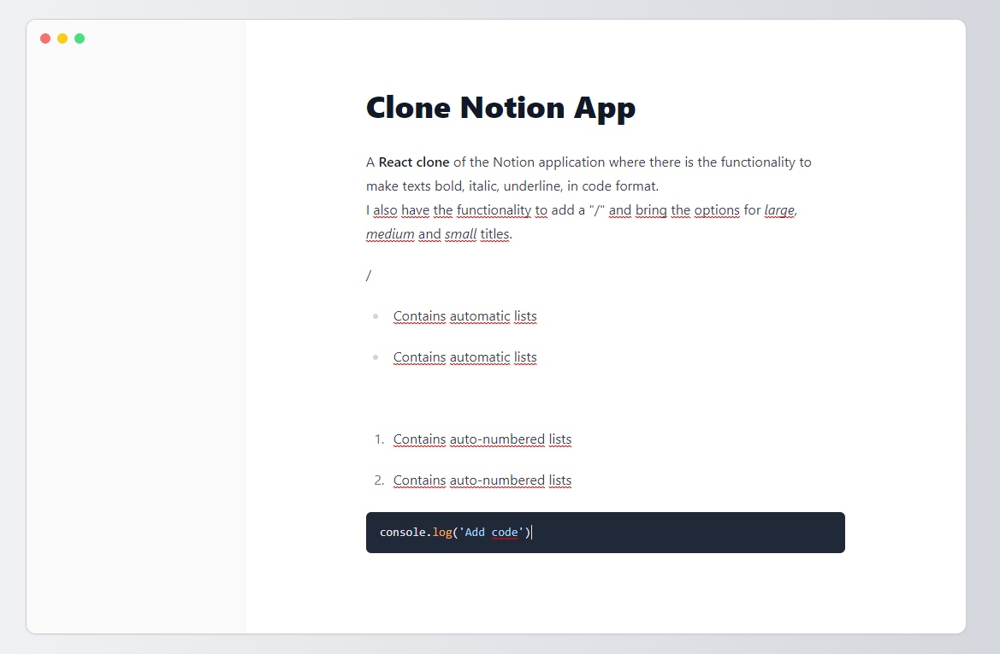
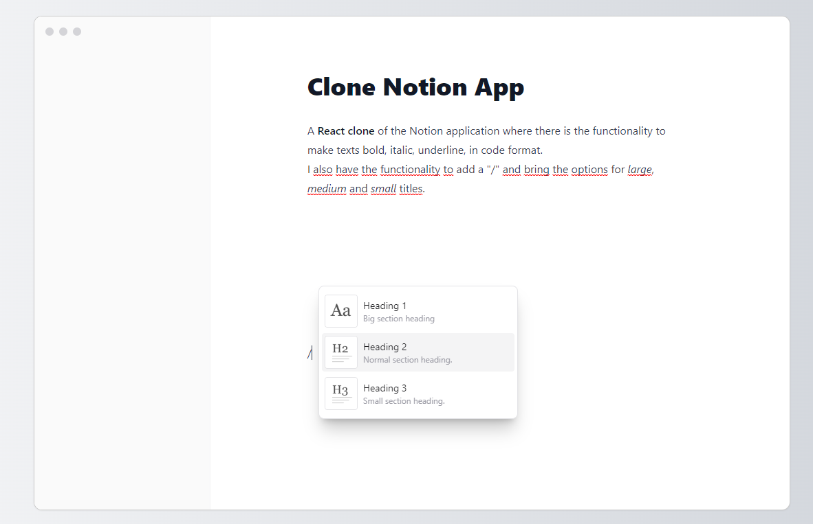
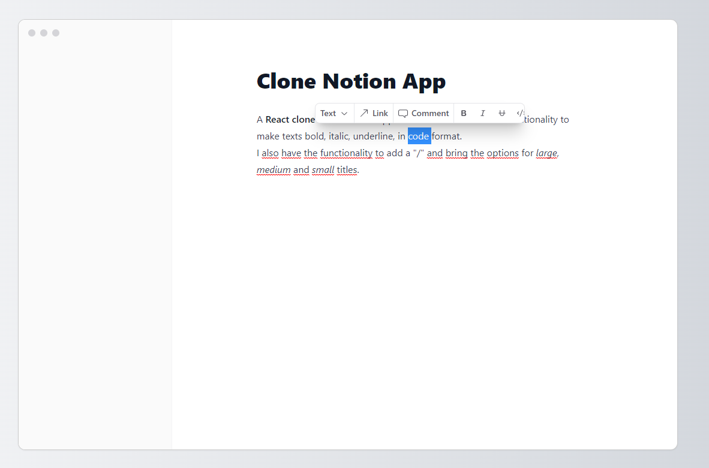

# CLONE NOTION

A React clone of the Notion application where there is the functionality to make texts bold, italic, underline, in code format.
I also have the functionality to add a "/" and bring the options for large, medium and small titles.

## 💻 IMAGE ONE


## 💻 IMAGE TWO


## 💻 IMAGE THREE


## 🛠️ Technologies
- React
- Vite
- TipTap Editor
- Typescript
- Tailwind
- PostCSS
- Git and Github

## 📞 Contact
- freitasfabiano08@gmail.com
- @fabinhofreitastw

## ⚙️ How To Install?
- Clone the repository
- Run the command: ```npm install```
- Run the command: ```npm run build```
- Enjoy!!!
